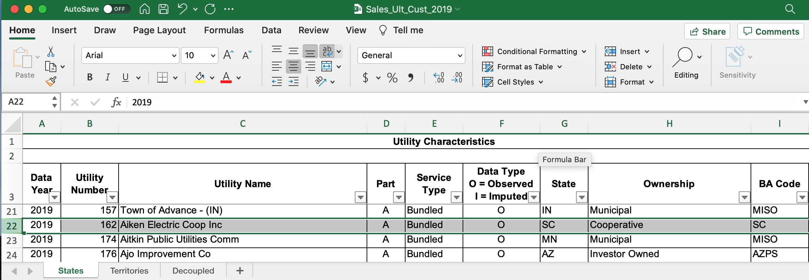
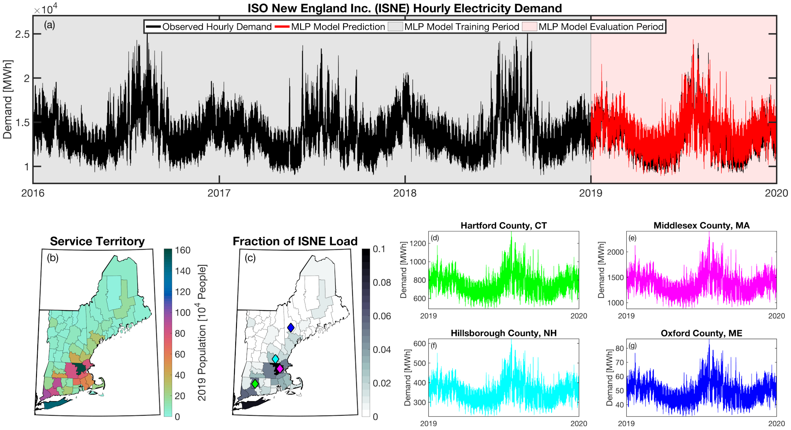

===============
User Guide
===============

Setting up a **tell** run
-------------------------

The following with introduce you to the input data required by **tell** and how to set up a configuration file to run **tell**.

Configuration file setup
~~~~~~~~~~~~~~~~~~~~~~~

The **tell** package utilizes a YAML configuration file customized by the user with scenario-specific settings.

The following are the required values if your wish to construct your own configuration files:

``settings``
^^^^^^^^^^^^
These are required values for project-level settings.

.. table::

    +--------------------+-------------------------------------------------------+-------+-------+
    | Name               | Description                                           | Unit  | Type  |
    +====================+=======================================================+=======+=======+
    | run_year           | Target year to run in YYYY format                     | year  | int   |
    +--------------------+-------------------------------------------------------+-------+-------+
    | scenario_name      | Name of the combined population and climate scenario  | NA    | str   |
    +--------------------+-------------------------------------------------------+-------+-------+
    | output_directory   | Directory to write the output data to                 | NA    | str   |
    +--------------------+-------------------------------------------------------+-------+-------+

The following is an example implementation in the YAML configuration file:

.. code-block:: yaml

  settings:
      run_year: 2020
      scenario_name: rcp45cooler_ssp3
      output_directory: <your output directory>

Tutorials
---------
Jupyter Notebooks

**tell** quickstarter
~~~~~~~~~~~~~~~~~~~~~
The following is a link to a Jupyter Notebook to run **tell**:  `tell quickstarter <https://github.com/IMMM-SFA/cerf/blob/main/notebooks/quickstarter.ipynb>`_

Fundamental concepts
----------------------------------
The following are the building blocks of how **tell** projects future loads.

Scenarios
~~~~~~~~~
**tell** is designed to work in conjunction with the United States version of the Global Change Analysis Model (GCAM-USA)
to explore different future scenarios of population and climate change. The models are configured to run the following
combinations of Representative Concentration Pathways (`RCPs <https://en.wikipedia.org/wiki/Representative_Concentration_Pathway>`_)
and Shared Socioeconomic Pathways (`SSPs <https://en.wikipedia.org/wiki/Shared_Socioeconomic_Pathways>`_):

.. list-table::
    :header-rows: 1

    * - Climate Scenario
      - Population Scenario
      - scenario_name
    * - RCP 4.5 - Cooler
      - SSP3
      - rcp45cooler_ssp3
    * - RCP 4.5 - Cooler
      - SSP5
      - rcp45cooler_ssp5
    * - RCP 4.5 - Hotter
      - SSP3
      - rcp45hotter_ssp3
    * - RCP 4.5 - Hotter
      - SSP5
      - rcp45hotter_ssp5
    * - RCP 8.5 - Cooler
      - SSP3
      - rcp85cooler_ssp3
    * - RCP 8.5 - Cooler
      - SSP5
      - rcp85cooler_ssp5
    * - RCP 8.5 - Hotter
      - SSP3
      - rcp85hotter_ssp3
    * - RCP 8.5 - Hotter
      - SSP5
      - rcp85hotter_ssp5

Balancing Authorities
~~~~~~~~~~~~~~~~~~~~~
The core predictions of **tell** occur at the scale of Balancing Authorities (BAs). BAs are responsible for the real-time balancing of electricity supply and demand within a given region of the electric grid.
For **tell**, BAs are useful because they represent the finest scale for which historical hourly load data is uniformly available across the U.S. This allows us to build an electric load forecasting
model that works across the entire country. **tell** uses historical (2015-2020) hourly load data from the `EIA-930 <https://www.eia.gov/electricity/gridmonitor/about>`_ dataset for BAs across the U.S. We note
that some smaller BAs are not included in the EIA-930 dataset. Other BAs are generation only or we were unable to geolocate them. Eight BAs (CISO, ERCO, MISO, ISNE, NYIS, PJM, PNM, and SWPP) started
reporting subregional loads in the EIA-930 dataset in 2018. Because we were unable to uniformly and objectively geolocate each of these subregions we opted to use the aggregate total loads for those BAs.
In total, we formulated a multi-layer perceptron (MLP) model for 55 out of the 68 BAs in the EIA-930 dataset.

.. list-table::
    :header-rows: 1

    * - BA Code
      - BA Name
      - EIA BA Number
      - Characteristics
    * - AEC
      - PowerSouth Energy Cooperative
      - 189
      - `Summary Figure 1 <source/images/AEC_Quick_Look_Plots.png>`_
    * - AECI
      - Associated Electric Cooperative
      - 924
      - `Summary Figure <images/AECI_Quick_Look_Plots.png>`_
    * - AVA
      - Avista Corporation
      - 20169
      - `Summary Figure <images/AVA_Quick_Look_Plots.png>`_
    * - **AVRN**
      - **Avangrid Renewables**
      - **NA**
      - **Generation Only**
    * - AZPS
      - Arizona Public Service Company
      - 803
      - `Summary Figure <images/AZPS_Quick_Look_Plots.png>`_
    * - BANC
      - Balancing Authority of Northern California
      - 16534
      - `Summary Figure <images/BANC_Quick_Look_Plots.png>`_
    * - BPAT
      - Bonneville Power Administration
      - 1738
      - `Summary Figure <images/BPAT_Quick_Look_Plots.png>`_
    * - CHPD
      - Public Utility District No. 1 of Chelan County
      - 3413
      - `Summary Figure <images/CHPD_Quick_Look_Plots.png>`_
    * - CISO
      - California Independent System Operator
      - 2775
      - `Summary Figure <images/CISO_Quick_Look_Plots.png>`_
    * - CPLE
      - Duke Energy Progress East
      - 3046
      - `Summary Figure <images/CPLE_Quick_Look_Plots.png>`_
    * - **CPLW**
      - **Duke Energy Progress West**
      - **NA**
      - **Not Geolocated**
    * - **DEAA**
      - **Arlington Valley**
      - **NA**
      - **Generation Only**
    * - DOPD
      - Public Utility District No. 1 of Douglas County
      - 5326
      - `Summary Figure <images/DOPD_Quick_Look_Plots.png>`_
    * - DUK
      - Duke Energy Carolinas
      - 5416
      - `Summary Figure <images/DUK_Quick_Look_Plots.png>`_
    * - **EEI**
      - **Electric Energy Inc.**
      - **NA**
      - **Generation Only**
    * - EPE
      - El Paso Electric Company
      - 5701
      - `Summary Figure <images/EPE_Quick_Look_Plots.png>`_
    * - ERCO
      - Electric Reliability Council of Texas
      - 5723
      - `Summary Figure <images/ERCO_Quick_Look_Plots.png>`_
    * - FMPP
      - Florida Municipal Power Pool
      - 14610
      - `Summary Figure <images/FMPP_Quick_Look_Plots.png>`_
    * - FPC
      - Duke Energy Florida
      - 6455
      - `Summary Figure <images/FPC_Quick_Look_Plots.png>`_
    * - FPL
      - Florida Power and Light
      - 6452
      - `Summary Figure <images/FPL_Quick_Look_Plots.png>`_
    * - GCPD
      - Public Utility District No. 2 of Grant County
      - 14624
      - `Summary Figure <images/GCPD_Quick_Look_Plots.png>`_
    * - **GLHB**
      - **GridLiance**
      - **NA**
      - **Not Geolocated**
    * - **GRID**
      - **Gridforce Energy Management**
      - **NA**
      - **Generation Only**
    * - **GRIF**
      - **Griffith Energy**
      - **NA**
      - **Generation Only**
    * - **GRMA**
      - **Gila River Power**
      - **NA**
      - **Generation Only**
    * - GVL
      - Gainesville Regional Utilities
      - 6909
      - `Summary Figure <images/GVL_Quick_Look_Plots.png>`_
    * - **GWA**
      - **NaturEner Power Watch**
      - **NA**
      - **Generation Only**
    * - **HGMA**
      - **New Harquahala Generating Company**
      - **NA**
      - **Generation Only**
    * - HST
      - City of Homestead
      - 8795
      - `Summary Figure <images/HST_Quick_Look_Plots.png>`_
    * - IID
      - Imperial Irrigation District
      - 9216
      - `Summary Figure <images/IID_Quick_Look_Plots.png>`_
    * - IPCO
      - Idaho Power Company
      - 9191
      - `Summary Figure <images/IPCO_Quick_Look_Plots.png>`_
    * - ISNE
      - Independent System Operator of New England
      - 13434
      - `Summary Figure <images/ISNE_Quick_Look_Plots.png>`_
    * - JEA
      - JEA
      - 9617
      - `Summary Figure <images/JEA_Quick_Look_Plots.png>`_
    * - LDWP
      - Los Angeles Department of Water and Power
      - 11208
      - `Summary Figure <images/LDWP_Quick_Look_Plots.png>`_
    * - LGEE
      - Louisville Gas and Electric Company and Kentucky Utilities Company
      - 11249
      - `Summary Figure <images/LGEE_Quick_Look_Plots.png>`_
    * - MISO
      - Midcontinent Independent System Operator
      - 56669
      - `Summary Figure <images/MISO_Quick_Look_Plots.png>`_
    * - NEVP
      - Nevada Power Company
      - 13407
      - `Summary Figure <images/NEVP_Quick_Look_Plots.png>`_
    * - NSB
      - Utilities Commission of New Smyrna Beach
      - 13485
      - `Summary Figure <images/NSB_Quick_Look_Plots.png>`_
    * - NWMT
      - NorthWestern Corporation
      - 12825
      - `Summary Figure <images/NWMT_Quick_Look_Plots.png>`_
    * - NYIS
      - New York Independent System Operator
      - 13501
      - `Summary Figure <images/NYIS_Quick_Look_Plots.png>`_
    * - **OVEC**
      - **Ohio Valley Electric Corporation**
      - **NA**
      - **Retired**
    * - PACE
      - PacifiCorp East
      - 14379
      - `Summary Figure <images/PACE_Quick_Look_Plots.png>`_
    * - PACW
      - PacifiCorp West
      - 14378
      - `Summary Figure <images/PACW_Quick_Look_Plots.png>`_
    * - PGE
      - Portland General Electric Company
      - 15248
      - `Summary Figure <images/PGE_Quick_Look_Plots.png>`_
    * - PJM
      - PJM Interconnection
      - 14725
      - `Summary Figure <images/PJM_Quick_Look_Plots.png>`_
    * - PNM
      - Public Service Company of New Mexico
      - 15473
      - `Summary Figure <images/PNM_Quick_Look_Plots.png>`_
    * - PSCO
      - Public Service Company of Colorado
      - 15466
      - `Summary Figure <images/PSCO_Quick_Look_Plots.png>`_
    * - PSEI
      - Puget Sound Energy
      - 15500
      - `Summary Figure <images/PSEI_Quick_Look_Plots.png>`_
    * - SC
      - South Carolina Public Service Authority
      - 17543
      - `Summary Figure <images/SC_Quick_Look_Plots.png>`_
    * - SCEG
      - South Carolina Electric and Gas Company
      - 17539
      - `Summary Figure <images/SCEG_Quick_Look_Plots.png>`_
    * - SCL
      - Seattle City Light
      - 16868
      - `Summary Figure <images/SCL_Quick_Look_Plots.png>`_
    * - SEC
      - Seminole Electric Cooperative
      - 21554
      - `Summary Figure <images/SEC_Quick_Look_Plots.png>`_
    * - SEPA
      - Southeastern Power Administration
      - **NA**
      - **Generation Only**
    * - SOCO
      - Southern Company Services - Transmission
      - 18195
      - `Summary Figure <images/SOCO_Quick_Look_Plots.png>`_
    * - SPA
      - Southwestern Power Administration
      - 17716
      - `Summary Figure <images/SPA_Quick_Look_Plots.png>`_
    * - SRP
      - Salt River Project
      - 16572
      - `Summary Figure <images/SRP_Quick_Look_Plots.png>`_
    * - SWPP
      - Southwest Power Pool
      - 59504
      - `Summary Figure <images/SWPP_Quick_Look_Plots.png>`_
    * - TAL
      - City of Tallahassee
      - 18445
      - `Summary Figure <images/TAL_Quick_Look_Plots.png>`_
    * - TEC
      - Tampa Electric Company
      - 18454
      - `Summary Figure <images/TEC_Quick_Look_Plots.png>`_
    * - TEPC
      - Tucson Electric Power
      - 24211
      - `Summary Figure <images/TEPC_Quick_Look_Plots.png>`_
    * - TIDC
      - Turlock Irrigation District
      - 19281
      - `Summary Figure <images/TIDC_Quick_Look_Plots.png>`_
    * - TPWR
      - City of Tacoma Department of Public Utilities
      - 18429
      - `Summary Figure <images/TPWR_Quick_Look_Plots.png>`_
    * - TVA
      - Tennessee Valley Authority
      - 18642
      - `Summary Figure <images/TVA_Quick_Look_Plots.png>`_
    * - WACM
      - Western Area Power Administration - Rocky Mountain Region
      - 28503
      - `Summary Figure <images/WACM_Quick_Look_Plots.png>`_
    * - WALC
      - Western Area Power Administration - Desert Southwest Region
      - 25471
      - `Summary Figure <images/WALC_Quick_Look_Plots.png>`_
    * - WAUW
      - Western Area Power Administration - Upper Great Plains West
      - 19610
      - `Summary Figure <images/WAUW_Quick_Look_Plots.png>`_
    * - **WWA**
      - **NaturEner Wind Watch**
      - **NA**
      - **Generation Only**
    * - **YAD**
      - **Alcoa Power Generating - Yadkin Division**
      - **NA**
      - **Generation Only**

Geolocating Balancing Authorities
~~~~~~~~~~~~~~~~~~~~~~~~~~~~~~~~~
As a spatially-explicit model, **tell** needs the ability to geolocate loads predicted by the model. Since the fundamental predictions
in **tell** occur at the spatial scale of BAs, we needed to devise a way to determine where each BA operated within the U.S.
For **tell**, being able to do  this geolocation using county boundaries has a number of benefits in terms of load disaggregation
and reaggregation - so we focused on techniques to map BAs to the counties they operate in. While there are multiple maps
of BA service territories available online, there are several fundamental challenges to using maps generated by others:

1. The provenance of the data and methodology underpinning most of the maps is unknown. In other words, there is no way to determine
how the BAs were placed and if the methods used to do so are robust.

2. The maps often depict the BAs as spatially unique and non-overlapping. For county-scale mapping at least, we know this to be
untrue. Additionally, the maps are mostly static representations of how BAs were configured at a single point in time. As the
actual territory of BAs can and does change over time, this presents challenges for placing BA loads occurring over a range of years.

3. Maps available online are often cartoon or stylized versions of reality with curvy lines that do not follow traditional geopolitical
boundaries. As such, to go from the cartoon map to an actual list of counties that a BA operates in would necessitate a number of
subjective decisions that are not 100% reproducible from person to person.

Given these limitations, we devised our own method to geolocate BAs in **tell**. We eventually found a publicly available
dataset from the EIA that served as our foundation. The `EIA-861 <https://www.eia.gov/electricity/data/eia861/>`_ dataset is an annual
report describing the characteristics of the electric power industry in the U.S. Among other information, EIA-861 contains two sets of
data that are critical to **tell**:

* The "Service_Territory_YYYY.xlsx" spreadsheet provides a list of every county that a given utility operates in:

.. image:: _static/utility_to_county.png
   :width: 600
   :align: center

* The "Sales_Ult_Cust_YYYY.xlsx" spreadsheet provides the BA that each utility reports to in a given state:

Using these two datasets in combination, **tell** reverse engineers the counties that each BA *likely* operated in within a given year. In
addition to being completely objective and reproducible, this method overcomes the limitations described above because it allows
more than one BA to be mapped to a single county and also allows the geolocation of BAs to evolve over time. **tell**
maps BA service territory annually from 2015-2019. The results of that mapping are contained in the .csv files below and are
summarized graphically in the map. The spatial extent of each BA in 2019 is shown in the "Summary_Figure" link for each
BA in the table above.

.. image:: _static/Overlapping_Balancing_Authorities_Map.png
   :width: 900
   :align: center

This figure shows the number of BAs that **tell** identifies as operating within each county in 2019. The bottom panel shows an example
of four different BAs reported operating in Brevard County, FL. While the majority of counties only have one BA identified, some counties
have as many as five. Note that a handful of counties had zero BAs identified as operating within them in 2019.

.. list-table::
    :header-rows: 1

    * - Year
      - Mapping File
    * - 2015
      - `Mapping <user_guide_data/fips_service_match_2015.csv>`_
    * - 2016
      - `Mapping <user_guide_data/fips_service_match_2016.csv>`_
    * - 2017
      - `Mapping <user_guide_data/fips_service_match_2017.csv>`_
    * - 2018
      - `Mapping <user_guide_data/fips_service_match_2018.csv>`_
    * - 2019
      - `Mapping <user_guide_data/fips_service_match_2019.csv>`_

Load Disaggregation and Reaggregation
~~~~~~~~~~~~~~~~~~~~~~~~~~~~~~~~~~~~~
**tell** uses multiple instances of load disaggregation and reaggregation in order to cross spatiotemporal scales. The fundamental
predictions in **tell** occur at the spatial scale of BAs. In order to compare those hourly load values at the BA-level with the
annual state-level load values produced by GCAM-USA we first disaggregate the hourly predicted BA-level loads to the county-level
and then reaggregate those hourly county-level loads to an annual total load prediction for each state. For each BA we identify
the counties that BA operates in using the methodology described above. We then use the
county-level populations for those counties to determine the fraction of the BA's total load that should be assigned to each county. A
graphical depiction of this for the ISNE BA is shown below. The load received by each county in a BA's service territory thus has the
same shape and temporal patterns, but the magnitude varies depending on the population in that county relative to the total population
in the BA's service territory. As there are spatial overlaps in BAs, many counties receive partial loads from more than one BA.

Once the load projections from all BAs in **tell** have been disaggregated to the county-level, we next sum up the loads from all
counties in a given state to get annual total state-level loads which are scaled to match the projections from GCAM-USA. The scaling
factors for each state are then applied to all county-level hourly load values in that state. The final output of **tell** is thus
a series of 8760-hr time series of total electricity loads at the state-, county-, and BA-level that are conceptually and quantitatively
consistent with one another.

It is important to note that the future evolution of population is also taken into account in **tell**. Projected annual changes in
population for each county and state are generated using the SSP scenarios. Those future populations are used in post-processing the
MLP models and to derive new weighting factors to be used in disaggregating and reaggregating future **tell** loads.
Thus, in an example scenario where lots of people move to Southern California, the counties there would not only receive a higher
proportion of the BA-level loads for BAs operating there, but would also have an incrementally larger impact on the future total
hourly load profile for California as a whole.

Multi-Layer Perceptron (MLP) Models
~~~~~~~~~~~~~~~~~~~~~~~~~~~~~~~~~~~
**tell** uses a series of multilayer perceptron (MLP) models to predict future loads. There is one unique MLP model for each BA. The
MLP models are trained on historical load data from the `EIA-930 <https://www.eia.gov/electricity/gridmonitor/about>`_ dataset and
weather from IM3's historical runs using the Weather Research and Forecasting (WRF) model. The MLP models for each BA were
trained on data from 2016-2018 and evaluated against observed loads from 2019. Details of the MLP predictive variables are included
in the table below.

.. list-table::
    :header-rows: 1

    * - Predictive Variable
      - Description
      - Units/Format
    * - Temperature
      - 2-m temperature from WRF (T2)
      - K
    * - Specific humidity
      - 2-m water vapor mixing ratio from WRF (Q2)
      - kg kg :sup:`-1`
    * - Shortwave radiation
      - Downward shortwave radiative flux from WRF (SWdn)
      - W m :sup:`-2`
    * - Longwave radiation
      - Downward longwave radiative flux from WRF (GLW)
      - W m :sup:`-2`
    * - Wind speed
      - Wind speed derived from 10-m U and V wind components from WRF (U10 and V10)
      - m s :sup:`-1`
    * - Day of the week
      - Day of the week
      - Weekday or weekend
    * - Hour of the day
      - Hour of the day in UTC
      - 00-23
    * - Population
      - Total population in the counties covered by the BA
      - NA

Key outputs
-----------
**tell** produces four types of output files. Each type of output is both written out as a .csv file in the ``output_directory`` and
returned as a Pandas DataFrame. Each type of output file can be suppressed by commenting out the relevant line in ``tell.execute_tell``.
Missing values in each output file are coded as -9999. All times are in UTC.

State summary data
~~~~~~~~~~~~~~~~~~
This output file gives the annual total loads for each of the 48 states in the CONUS and the District of Columbia. It also contains the scaling factor for each state that force the aggregate annual total loads from  **tell** to agree with those produced by GCAM-USA.

Filename: *TELL_State_Summary_Data_YYYY.csv*

DataFrame: *TBD*

.. list-table::
    :header-rows: 1

    * - Name
      - Description
      - Units/Format
    * - Year
      - Year of load
      - NA
    * - State_Name
      - Name of the state
      - NA
    * - State_FIPS
      - `FIPS <https://www.census.gov/library/reference/code-lists/ansi.html>`_ code of the state
      - NA
    * - State_Scaling_Factor
      - Scaling factor to force agreement between **tell** and GCAM-USA annual total loads
      - NA
    * - GCAM_USA_Load_TWh
      - Annual total load for the state from GCAM-USA
      - TWh
    * - Raw_TELL_Load_TWh
      - Unscaled annual total load for the state from TELL
      - TWh
    * - Scaled_TELL_Load_TWh
      - Scaled annual total load for the state from TELL
      - TWh

State hourly load data
~~~~~~~~~~~~~~~~~~~~~~
This output file gives the hourly time-series of total loads for each of the 48 states in the CONUS and the District of Columbia.

Filename: *TELL_State_Hourly_Load_Data_YYYY.csv*

DataFrame: *TBD*

.. list-table::
    :header-rows: 1

    * - Name
      - Description
      - Units/Format
    * - State_Name
      - Name of the state
      - NA
    * - State_FIPS
      - `FIPS <https://www.census.gov/library/reference/code-lists/ansi.html>`_ code of the state
      - NA
    * - Time_UTC
      - Hour of the load in UTC
      - YYYY-MM-DD HH:MM:SS
    * - Raw_TELL_State_Load_MWh
      - Unscaled hourly total load for the state from TELL
      - MWh
    * - Scaled_TELL_State_Load_MWh
      - Scaled hourly total load for the state from TELL
      - MWh

Balancing authority hourly load data
~~~~~~~~~~~~~~~~~~~~~~~~~~~~~~~~~~~~
This output file gives the hourly time-series of total loads for each of the BAs simulated by **tell**.

Filename: *TELL_Balancing_Authority_Hourly_Load_Data_YYYY.csv*

DataFrame: *TBD*

.. list-table::
    :header-rows: 1

    * - Name
      - Description
      - Units/Format
    * - BA_Code
      - Alphanumeric code for the BA
      - NA
    * - BA_Number
      - Designated EIA number for the BA
      - NA
    * - Time_UTC
      - Hour of the load in UTC
      - YYYY-MM-DD HH:MM:SS
    * - Raw_TELL_BA_Load_MWh
      - Unscaled hourly total load for the BA from TELL
      - MWh
    * - Scaled_TELL_BA_Load_MWh
      - Scaled hourly total load for the BA from TELL
      - MWh

County hourly load data
~~~~~~~~~~~~~~~~~~~~~~~~~~~~~~~~~~~~
This collection of output files gives the hourly time-series of total loads for each county in the CONUS and the District of Columbia. These output files are stored in a subdirectory of ``output_directory`` named ``County_Level_Data``.

Filename Format: *TELL_statename_countyname_Hourly_Load_Data_YYYY.csv*

DataFrame: *TBD*

.. list-table::
    :header-rows: 1

    * - Name
      - Description
      - Units/Format
    * - County_Name
      - Name of the county
      - NA
    * - County_FIPS
      - `FIPS <https://www.census.gov/library/reference/code-lists/ansi.html>`_ code of the county
      - NA
    * - State_Name
      - Name of the state the county is in
      - NA
    * - State_FIPS
      - `FIPS <https://www.census.gov/library/reference/code-lists/ansi.html>`_ code of the state
      - NA
    * - Time_UTC
      - Hour of the load in UTC
      - YYYY-MM-DD HH:MM:SS
    * - Raw_TELL_County_Load_MWh
      - Unscaled hourly total load for the county from TELL
      - MWh
    * - Scaled_TELL_County_Load_MWh
      - Scaled hourly total load for the county from TELL
      - MWh