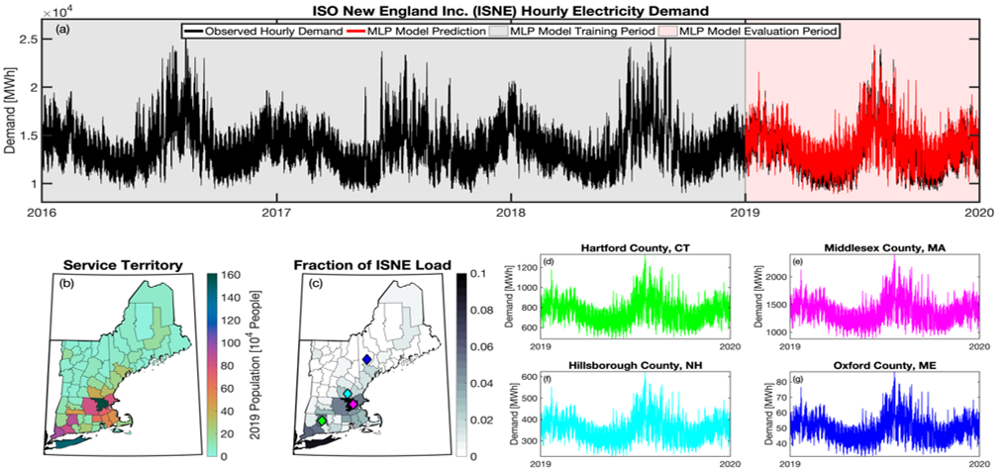

[GitHub Repository]: https://github.com/IMMM-SFA/tell 
[Jupyter Notebook]: https://immm-sfa.github.io/tell/tell_quickstarter.html
[User Guide]: https://immm-sfa.github.io/tell/user_guide.html

# Summary 
The purpose of the Total ELectricity Load (`tell`) model is to generate 21st century profiles of 
hourly electricity load (demand) across the Conterminous United States (CONUS). `tell` loads reflect the 
impact of climate and socioeconomic change at a spatial and temporal resolution adequate for input
to an electricity grid operations model. `tell` uses machine learning to develop profiles that are 
driven by projections of climate/meteorology and population. `tell` also harmonizes its results with
United States (U.S.) state-level, annual projections from a national- to global-scale
energy-economy model. This model accounts for a wide range of other factors affecting 
electricity demand, including technology change in the building sector, energy prices, and 
demand elasticities, which stems from model coupling with the U.S. version of the 
Global Change Analysis Model (GCAM-USA). `tell` was developed as part of
the Integrated Multisector Multiscale Modeling (IM3) project. IM3 explores the vulnerability and resilience of interacting energy,
water, land, and urban systems in response to compound stressors, such as climate trends, 
extreme events, population, urbanization, energy system transitions, and technology change.

# Statement of Need
To understand and plan for the resilience of the electricity system in the U.S., we need load 
projections that are responsive to compounding anthropogenic and natural stressors and have
sufficient spatial and temporal resolution for grid stress modeling [@carvallo2018; @oikonomou2022].
`tell` fills this gap. `tell` is unique from other load projection models in several ways. It 
coherently blends aspects of short- and long-term load projections. Short- and medium-term load
models most commonly relate meteorology and day-of-week parameters to loads 
[@hong2016 and references therein]. Longer-term models also use 
meteorology/climate as explanatory variables, typically relying on climate trends, but also 
include “macro” variables like the decadal evolution of population or economic indicators 
[@al-hamadi2005; @hong2014; @lindberg2019]. There is limited research that combines short- 
and long-term modeling approaches [@boßmann2015; @lindberg2019; @behm2020]. The most 
relevant existing approach is Behm et al. [@behm2020], which used an artificial neural network
approach to simulate hourly electricity loads in a handful of European countries based on 
population-weighted meteorology and date parameters and then used exogenous future annual 
peak loads to scale their hourly projections. The scaling to future peak loads is analogous 
to how we use the national to global energy-economy model in `tell`. 

`tell` has a spatial component that allows us to distribute projected loads where they would occur 
spatially within a high-resolution grid operations model. Most other models are for a specific 
geographic context (i.e., a single utility or Balancing Authority [BA]) and therefore do not have 
any spatial element to their projections [@al-hamadi2005; @hong2014; @carvallo2018; @lindberg2019].
In contrast, `tell` is a meta-model made up of an aggregation of individual MLP models for 54 BAs. 
`tell` covers the entire CONUS so that its output can be flexibly aggregated as input to a grid 
operations model in any of three U.S. grid interconnections. Finally, `tell` is based entirely on 
publicly available, open data and is being released as an extensively documented open-source code base 
so that it can be freely and easily reused by others. While `tell` is designed for 54 BAs in the CONUS 
and relies on the GCAM-USA model, the core MLP modeling approach could be readily adapted to work in 
other regions with adequate historical data.

# Design and Functionality
`tell` integrates aspects of both short- and long-term projections of electricity demand in a coherent
and scalable way. `tell` takes time series meteorological data at one-hour resolution as input and
uses the temporal variations in weather to project hourly time-series of total electricity demand.
The core predictions in `tell` are based on a series of multilayer perceptron (MLP) models [@scikit-learn] that 
relate historical meteorology to coincident BA-scale hourly loads for 54 independent BAs.
The BA load projections are first disaggregated to the county-level and then summed and scaled to 
match the annual state-level total electricity demands projected by the U.S. version of the 
Global Change Analysis Model (GCAM-USA) [@iyer2017; @binsted2022]. GCAM-USA is designed to 
capture the long-term co-evolution of energy, water, land, and economic systems. This approach 
allows `tell` to reflect changes in the shape of the load profile due to variations in weather and 
climate as well as the long-term evolution of energy demand due to changes in population, 
technology, and economics. The projections from `tell` are quantitatively and conceptually 
consistent across county-, state-, and BA-scales.

The basic workflow for `tell` proceeds in six sequential steps:
1.	Formulate empirical models that relate the historical observed meteorology to the hourly 
time-series of total electricity demand for 54 BAs that report their hourly loads in the EIA-930 
dataset (Fig. 1a).
2.	Use the empirical models to project future hourly loads for each BA based on IM3’s future 
climate scenarios generated using the Weather Research and Forecasting [@wrf] model.
3.	Distribute the hourly loads for each BA to the counties that BA operates in and then aggregate
 the county-level hourly loads from all BAs into annual state-level loads (Fig. 1b-g).
4.	Calculate annual state-level scaling factors that force the bottom-up annual state-level total
 loads from `tell` to match the annual state-level total loads from GCAM-USA.
5.	Apply the state-level scaling factors to each county- and BA-level time-series of hourly total
 demand.
6.	Output yearly 8760-hr time-series of total electricity demand at the county-, state-, and 
BA-scale that are conceptually and quantitatively consistent with each other.

 
*Fig. 1. a) Time-series of observed and projected hourly electricity demand within the Independent 
System Operator of New England (ISNE) BA during the training (2016-2019) and evaluation (2019) periods 
for TELL; b) County-level populations within the ISNE BA service territory in 2019; c) Fraction of the 
total population within the BA that lives in each county; and d-g) Time-series of projected hourly 
electricity demand in 2019 for select counties based on their population weights.*

`tell` is an open source model that can be accessed via the [GitHub Repository]. 
The repository also includes a [Jupyter Notebook] that provides a walk through of the core functionality 
of `tell`. This notebook also provides easy access to statistical validation results between the forecasts 
and observed data. Finally, more details about how the  model was formulated and its intended purpose 
can be found in the `tell` [User Guide].

# Acknowledgements
This research was supported in part by the U.S. Department of Energy, Office of Science, as part
of research in MultiSector Dynamics, Earth and Environmental System Modeling Program. The
Pacific Northwest National Laboratory is operated for DOE by Battelle Memorial Institute under
contract DE-AC05-76RL01830. The views and opinions expressed in this paper are those of the 
authors alone.

# References
