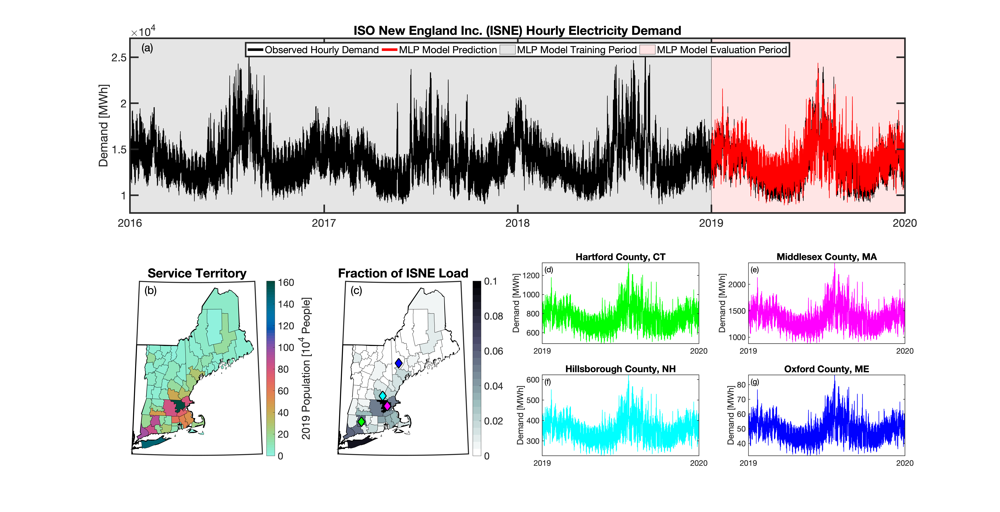

# Summary 
The purpose of the Total ELectricity Load (TELL) model is to generate end-of-century hourly profiles of 
electricity demand across the entire Conterminous United States (CONUS) at a spatial resolution adequate
for input to a unit commitment/economic dispatch (UC/ED) model while also maintaining consistency with 
the long-term growth and evolution of annual state-level electricity demand projected by an economically
driven human-Earth system model. `tell` was developed as part of the Integrated, Multisector, Multiscale 
Modeling (IM3) project. IM3 explores the responses of interacting energy, water, land, and urban 
systems to compound influences such as climate, extreme events such as heat waves and drought, 
population, urbanization, and other socioeconomic factors, energy system transitions, and technology 
change.

# Statement of need
Projecting changes in electricity demand (load) in response to anthropogenic and natural stressors is 
necessary for promoting energy system resilience [@oikonomou2022]. Given the pressures of aging 
infrastructure and the increasing integration of renewables, realistic load projections are critical for 
maintaining a stable grid and as a basis for long-term planning [@carvallo2018]. Recently there 
have been advances in both short-term (minutes to hours ahead) and long-term (months to years ahead) 
load forecasting approaches [@hong2016]. The general structure of these types of models 
are, understandably, quite different. Short- and medium-term load models most commonly relate meteorology
and day-of-week parameters to loads [@hong2016 and references therein]. Longer-term 
models also use meteorology/climate as explanatory variables, typically relying on climate trends, 
but also include “macro” variables like the decadal evolution of population or economic indicators 
[@al-hamadi2005; hong2014; lindberg2019].

`tell` integrates aspects of both short- and long-term projections of electricity demand in a coherent and
scalable way. `tell` takes time series meteorological data at one-hour resolution as input and uses the 
temporal variations in weather to project hourly time-series of total electricity demand. The core 
predictions in `tell` are based on a series of multilayer perceptron (MLP) models that relate historical 
meteorology to coincident balancing authority-scale hourly loads for 54 independent balancing 
authorities (BAs). The BA load projections are first disaggregated to the county-level and then the 
hourly county-level projections from `tell` are scaled to match the annual state-level total electricity 
demands projected by the U.S. version of the Global Change Analysis Model (GCAM-USA). GCAM-USA is 
designed to capture the long-term co-evolution of human-Earth systems 
[@iyer2017; binsted2021]. This approach allows `tell` to reflect changes in the shape of 
the load profile due to variations in weather and climate as well as the long-term evolution of energy 
demand due to changes in population, technology, and economics. The projections from `tell` are 
quantitatively and conceptually consistent across county-, state-, and BA-scales.

`tell` is unique from other load projection models in several ways. First, there are only a handful of 
papers [@boßmann2015; lindberg2019; behm2020] that coherently blend aspects
of short- and long-term load projections. The most relevant existing approach is Behm et al. [@behm2020], 
who used an Artificial Neural Network approach to simulate hourly electricity loads in a handful of 
European countries based on population-weighted meteorology and date parameters and then used exogenous 
future annual peak loads to scale their hourly projections. The scaling to future peak loads is
analogous to how we use GCAM-USA in `tell`. Secondly, `tell` has a spatial component that allows us to 
distribute projected loads where they would occur spatially within a nodal UC/ED model. Most other 
models are for a specific geographic context (i.e., a single utility or BA) and therefore do not have
any spatial element to their projections 
[@al-hamadi2005; hong2017; carvallo2018; lindberg2019]. In 
contrast, `tell` is a meta-model made up of an aggregation of individual MLP models for 54 BAs. 
Thirdly, `tell` covers the entire CONUS so that output from `tell` can be used as input to a UC/ED 
model in any of three U.S. grid interconnections. Finally, `tell` is based entirely on publicly
available data and is being released as an extensively documented open-source code base so that it 
can be freely and easily reused by others.

# Design and Functionality
The basic workflow for `tell` proceeds in six sequential steps:
1.	Formulate empirical models that relate the historical observed meteorology to the hourly 
time-series of total electricity demand for 54 BAs that report their hourly loads in the EIA-930 
dataset (Fig. 1a).
2.	Use the empirical models to project future hourly loads for each BA based on IM3’s future climate 
and population scenarios.
3.	Distribute the hourly loads for each BA to the counties that BA operates in and then aggregate the 
county-level hourly loads from all BAs into annual state-level loads (Fig. 1b-g).
4.	Calculate annual state-level scaling factors that force the bottom-up annual state-level total 
loads from `tell` to match the annual state-level total loads from GCAM-USA.
5.	Apply the state-level scaling factors to each county- and BA-level time-series of hourly total 
demand.
6.	Output yearly 8760-hr time-series of total electricity demand at the state-, county-, and BA-scale 
that are conceptually and quantitatively consistent with each other.

 
*Fig. 1. a) Time-series of observed and projected hourly electricity demand within the Independent 
System Operator of New England (ISNE) BA during the training (2016-2019) and evaluation (2019) periods 
for TELL; b) County-level populations within the ISNE BA service territory in 2019; c) Fraction of the 
total population within the BA that lives in each county; and d-g) Time-series of projected hourly 
electricity demand in 2019 for select counties based on their population weights.*

`tell` is an open-source model that can be accessed via GitHub (https://github.com/IMMM-SFA/tell). 
The repository also includes a Jupyter notebook that provides a walkthrough of the core functionality 
of `tell` (https://immm-sfa.github.io/tell/tell_quickstarter.html). Finally, more details about how the 
model was formulated and its intended purpose can be found in the `tell` User Guide 
(https://immm-sfa.github.io/tell/user_guide.html).

# Acknowledgements
This research was supported in part by the U.S. Department of Energy, Office of Science, as part of research in MultiSector Dynamics, Earth and Environmental System Modeling Program. The Pacific Northwest National Laboratory is operated for DOE by Battelle Memorial Institute under contract DE-AC05-76RL01830. The views and opinions expressed in this paper are those of the authors alone.

# References
