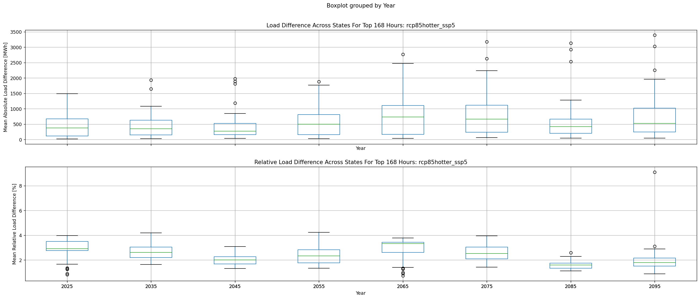
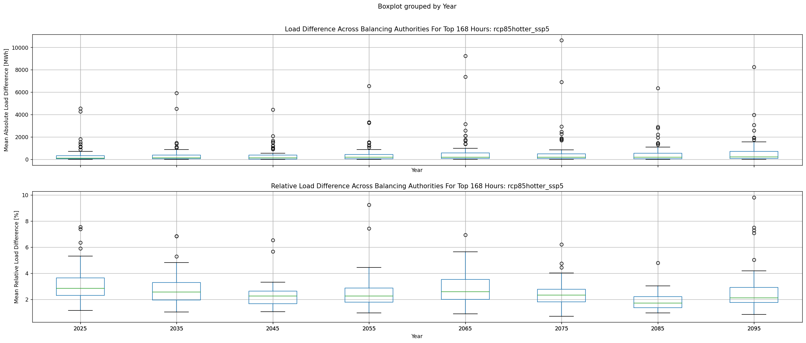

# Quickview Analysis of TELL Load Duration Curve Variability
>
## Purpose
This analysis looks at the interannual variability in the load duration curve (LDC) for each Balancing Authority (BA) 
and state simulated by the TELL model.
>
## Notes
>
1. Right now the plots are set to focus on the highest 168 hours (7 days) of load for each BA and state. This helps to
demonstrate variability in peak loads.
>
## Summary Figures
The figures below show box-plots of the mean difference between annual LDCs (e.g., each year from 2020-2030 
) and the center year LDC (e.g., 2025) for all states and BAs. The top panel shows the distribution of the actual 
average load difference in MWh and the bottom panel shows the distribution of the average relative difference 
(i.e., abs[Center Year - Year]/  Center Year). The calculations are for the top 168 hours of load for each individual 
state or BA.

## Balancing Authority Analyses
>
| Name | rcp85cooler_ssp3 | rcp85cooler_ssp5 | rcp85hotter_ssp3 | rcp85hotter_ssp5 |
| :-: | :-: | :-: | :-: | :-: |
| CISO | - | - | - | [Plot](rcp85hotter_ssp5/TELL_BA_LDC_Variability_CISO_rcp85hotter_ssp5.png) |
| PJM | - | - | - | [Plot](rcp85hotter_ssp5/TELL_BA_LDC_Variability_PJM_rcp85hotter_ssp5.png) |
| ERCO | - | - | - | [Plot](rcp85hotter_ssp5/TELL_BA_LDC_Variability_ERCO_rcp85hotter_ssp5.png) |
| ISNE | - | - | - | [Plot](rcp85hotter_ssp5/TELL_BA_LDC_Variability_ISNE_rcp85hotter_ssp5.png) |
| MISO | - | - | - | [Plot](rcp85hotter_ssp5/TELL_BA_LDC_Variability_MISO_rcp85hotter_ssp5.png) |
| AZPS | - | - | - | [Plot](rcp85hotter_ssp5/TELL_BA_LDC_Variability_AZPS_rcp85hotter_ssp5.png) |
>
## State Analyses
>
| Name | rcp85cooler_ssp3 | rcp85cooler_ssp5 | rcp85hotter_ssp3 | rcp85hotter_ssp5 |
| :-: | :-: | :-: | :-: | :-: |
| California | - | - | - | [Plot](rcp85hotter_ssp5/TELL_State_LDC_Variability_California_rcp85hotter_ssp5.png) |
| Texas | - | - | - | [Plot](rcp85hotter_ssp5/TELL_State_LDC_Variability_Texas_rcp85hotter_ssp5.png) |
| New York | - | - | - | [Plot](rcp85hotter_ssp5/TELL_State_LDC_Variability_New_York_rcp85hotter_ssp5.png) |
| Pennsylvania | - | - | - | [Plot](rcp85hotter_ssp5/TELL_State_LDC_Variability_Pennsylvania_rcp85hotter_ssp5.png) |
| Florida | - | - | - | [Plot](rcp85hotter_ssp5/TELL_State_LDC_Variability_Florida_rcp85hotter_ssp5.png) |
| Washington | - | - | - | [Plot](rcp85hotter_ssp5/TELL_State_LDC_Variability_Washington_rcp85hotter_ssp5.png) |

